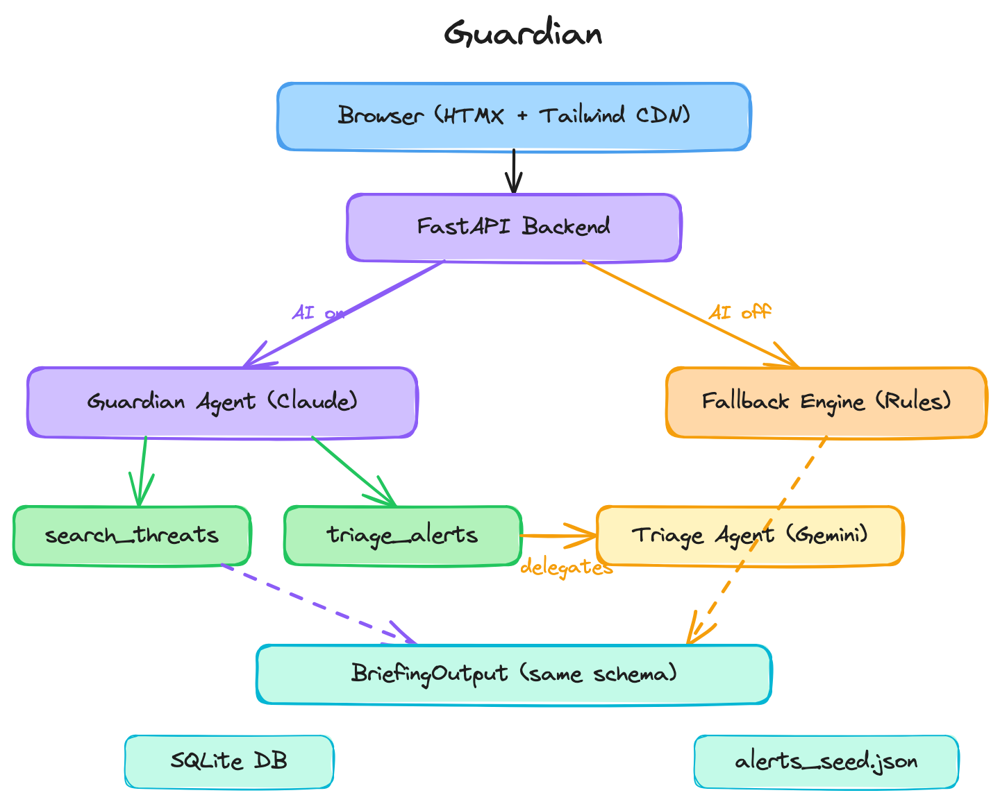

Candidate Name: Shreyan Gupta
Scenario Chosen: Community Safety & Digital Wellness
Estimated Time Spent: In Progress

## Guardian

Security alerts are noisy. Most people don't have time to figure out which ones actually matter to them. Guardian is a personal security advisor that filters that noise based on your actual digital profile: what services you use, where you live, how you work.

You tell it about yourself, and it investigates. It searches a threat database, scores each alert's relevance to you specifically, and gives you a briefing with the stuff you actually need to do.

### Quick Start

```bash
python -m venv .venv
source .venv/bin/activate
pip install -r requirements.txt
cp .env.example .env  # add your API keys
uvicorn app.main:app --reload
```

Set `AI_ENABLED=false` in `.env` to run without API keys. Everything still works with rule-based fallbacks.

### What's under the hood

The core is a PydanticAI agent (Claude Sonnet 4.6) that has tools it can call. It decides what to investigate and delegates alert classification to a lighter model (Gemini Flash-Lite). The agent searches, classifies, finds correlations across alerts, and produces a structured briefing.

Every AI feature has a complete rule-based fallback. Same data flow, same output format, just deterministic rules instead of model calls.



### AI Disclosure

- Did you use an AI assistant? Yes (Claude for architecture planning, Claude Code for implementation)
- How did you verify the suggestions? Manual code review, tested all outputs, validated against rubric
- Example of a suggestion you rejected or changed: TBD

### Tradeoffs & Prioritization

- What did you cut to stay within the 4-6 hour limit? TBD
- What would you build next if you had more time? TBD
- Known limitations: TBD
